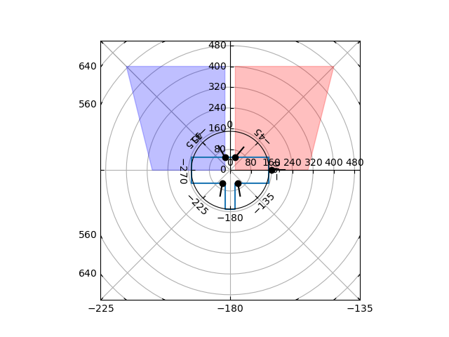

# Fonctions utiles

## Data Plot

Ce script permet de visualiser les données que l'on a inscrites dans les fichiers de configuration.

On retrouve :
* La forme du robot
* Les capteurs 
* Leur direction
* Les aires de detection d'obstacle


<p align="center">
Exemple d'affichage des zônes avec deux capteurs

</p>

## Yaml Utils

Cette fonction permet de simplement importer un fichier `yaml` et de le convertir en dictionnaire.

**Utilisation :**

Voici un exemple d'utilisation :

```python
nom_fichier = './src/robot_config.yaml'
dictionnaire = yaml_data_import(nom_fichier)
print(dictionnaire)
```
Ce script retourne alors un dictionnaire avec toutes les valeurs. On les utilise ensuite dans le script `data_robot_creator`.

## Get table point

Ce script permet d'extraire les points de la table du fichier de configuration `table_config.yaml` et de les mettre dans une liste python facilement affichage avec Matplotlib.

## Auteurs

 <table style="width:100%" >
  <tr>
    <th>
    <a href="https://github.com/S6ril/">
      
    </a>
    </th>
    <th>
    <a href="https://github.com/Starfunx">
      
    </a>
    </th>
  </tr>
  <tr>
    <th>S6ril</td>
    <th>Starfunx</td>
  </tr>
</table> 


<p align="center">

</p>